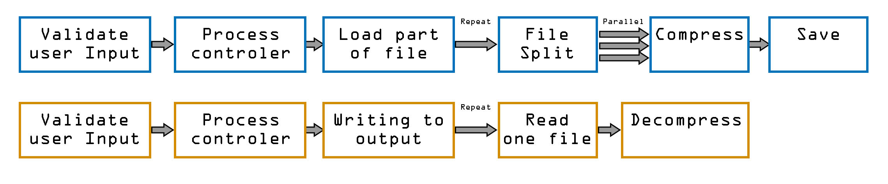

# GZipTest

`Name:` GZipTest, `Date:` 2019.09.20, `Project:` Visual studio 2019, `Framework:` 4.7.2, `Program language:` English, `Comments:` English, `Description:` CMD program for split target file to multiple compressed one. Or merge it back.

`Powershell script for demonstration how use GZipTest` 

```powershell
#compress
$pathToExe = "C:\Users\User123\source\repos\2019.07.29_GZipTest\GZipTest\bin\Debug\GZipTest.exe"
$pathToSource = "D:\User123\Downloads\Video01.MP4"
$pathToOutput = "D:\User123\Downloads\zipTest\zipedFile"
& $pathToExe compress $pathToSource $pathToOutput
if($LASTEXITCODE -eq 0)
{Write-Host "Command successfull"} 
else 
{Write-Host "Command failed"}
```

```powershell
#decompress
$pathToExe = "C:\Users\User123\source\repos\2019.07.29_GZipTest\GZipTest\bin\Debug\GZipTest.exe"
$pathToSource = "D:\User123\Downloads\zipTest\zipedFile1.gz"
$pathToOutput = "D:\User123\Downloads\zipTest\unziped.MP4"
& $pathToExe decompress $pathToSource $pathToOutput
if($LASTEXITCODE -eq 0)
{Write-Host "Command successfull"} 
else 
{Write-Host "Command failed"}
```

`Program flow:` 
